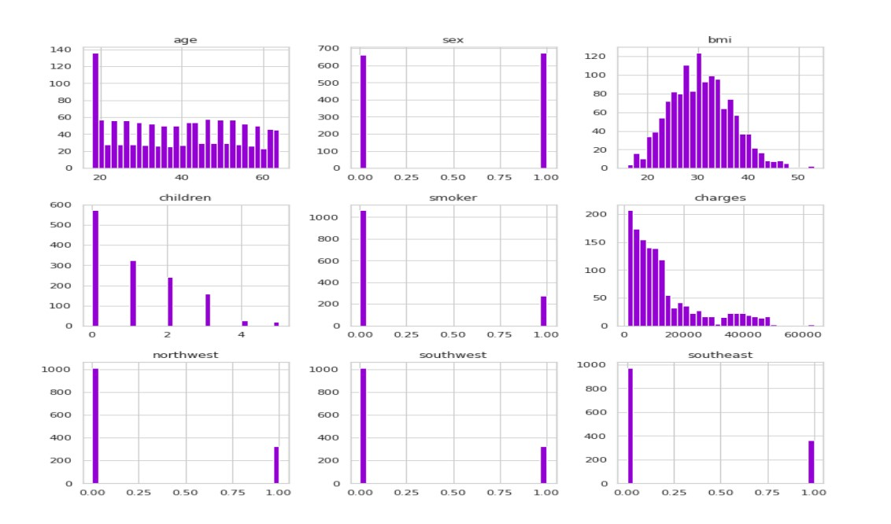
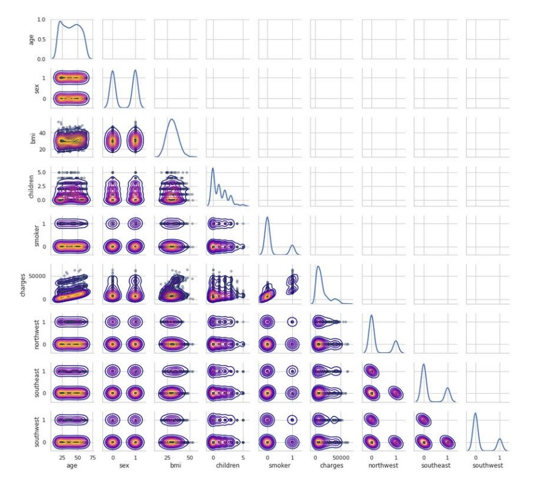
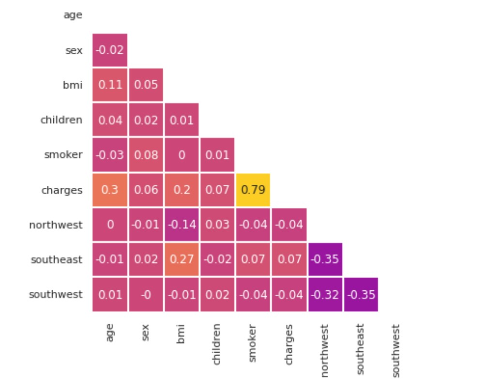
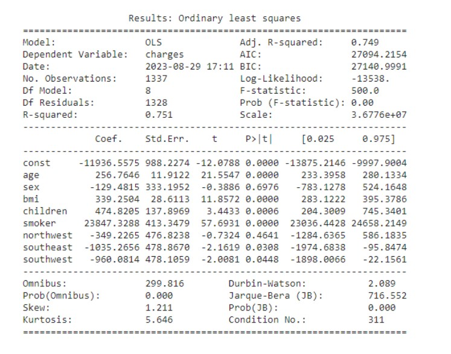

# Prediction, Comparison, and Visualization of Premium Pricing Using Machine Learning Methods

## Overview
This project focuses on predicting health insurance premiums using machine learning models, improving the accuracy and efficiency of premium pricing. By leveraging a US health insurance dataset, we developed various machine learning models to predict premium costs, using features like age, BMI, smoking habits, and geographical location.

The study presents the transformative capacity of machine learning (ML) techniques to minimize manual labor, enhance pricing precision, and visualize data trends for both insurers and policyholders. Our key models, XGBoost and Artificial Neural Networks (ANN), achieved high accuracy, with XGBoost excelling with an adjusted R² of 90.1%.

You can access the full research paper [here](./Farzan Tashfeen Paper.pdf).

## Problem Statement
Health insurance premium pricing is a complex process, influenced by various personal factors such as age, BMI, and lifestyle habits. Traditional methods of determining premiums involve manual effort and may lack precision. This project aims to streamline and enhance the prediction process using machine learning models that offer more accurate and efficient pricing.

## Project Objective
- To improve the accuracy of health insurance premium predictions.
- To minimize manual labor and human error in pricing.
- To visualize data trends for decision-making purposes.
- To develop a model that benefits both insurers and policyholders by offering precise and fair pricing.

## Dataset
We utilized an open-source dataset of US health insurance premiums, containing variables such as:
- **Age**
- **Sex**
- **BMI (Body Mass Index)**
- **Number of Children**
- **Smoking Habits**
- **Region**

The dataset was preprocessed by removing duplicates, transforming categorical variables into binary formats, and performing feature engineering for model compatibility.

## Methodology
### a. Data Import & Preprocessing:
- **Dataset**: The US Health Insurance Dataset includes variables such as age, BMI, number of children, smoking habits, and geographical region.
- **Data Cleaning**: The dataset was cleaned to remove duplicates and irrelevant entries. 
- **Feature Engineering**: Categorical features like sex and smoker status were converted to binary values for easier processing by ML algorithms.

### b. Exploratory Data Analysis (EDA):
- **Histogram Analysis**: Histograms were created to visualize the distribution of individual variables like age, BMI, smoking habits, and insurance charges.
  
- **Correlation Analysis**: A correlation matrix was computed to identify relationships between numerical variables.
  
- **Pair Grid Plot**: This visualized the relationships between variables in the dataset.
  

### c. Statistical Significance:
- **OLS Regression**: An Ordinary Least Squares (OLS) regression model was used to determine the significance of each feature in predicting premiums.
  

### d. Model Development:
- Multiple machine learning models were developed and trained on the dataset, including Linear Regression, Ridge Regression, Lasso Regression, XGBoost, and Artificial Neural Networks (ANN).

## Key Models and Performance Results
Several machine learning models were tested:

### a. Linear Regression:
- **Performance**:
  - MAE: 0.346
  - RMSE: 0.244
  - Adjusted R²: 80.1%

### b. Ridge Regression:
- **Performance**:
  - MAE: 0.346
  - RMSE: 0.495
  - Adjusted R²: 80.4%

### c. XGBoost (Extreme Gradient Boosting):
- **Performance**:
  - MAE: 0.184
  - RMSE: 0.349
  - Adjusted R²: 90.1%

### d. Artificial Neural Networks (ANN):
- **Performance**:
  - Accuracy: 93.07%
  - Adjusted R²: 92.25%

### e. Support Vector Regression (SVR):
- **Performance**:
  - MAE: 0.175
  - RMSE: 0.369
  - Adjusted R²: 89.0%

## Visualization
Visualization played a critical role in both data exploration and model performance evaluation:

### a. Histograms:
- **Histograms** were generated for variables such as age, BMI, charges, and smoker status.

### b. Pair Grid Plot:
- The **Pair Grid Plot** visualized the relationships between all numerical variables, showing how age, BMI, and charges interact.

### c. Correlation Matrix:
- A **correlation matrix** was generated to display the correlation coefficients between numerical variables, identifying strong relationships such as the positive correlation between smoker status and premium charges.

### d. Model Comparison Chart:
- A bar chart compared the performance of different models in terms of **RMSE** and **Adjusted R²**.

## Results

| Models                                            | ul Hassan et al. | Kaushik et al. | Kafuria et al. | The Present Study  |
|---------------------------------------------------|-----------------------|---------------------|---------------------|--------------------|
| **XGBoost**                                       | RMSE: 0.343, R²: 0.883 | Not used            | Not used            | RMSE: 0.349, R²: 0.902  |
| **Random Forest**                                 | RMSE: 0.348, R²: 0.879 | Not used            | RMSE: 4783.8, R²: 0.853 | RMSE: 0.388, R²: 0.881 |
| **Support Vector Regression (SVR)**               | RMSE: 0.359, R²: 0.871 | Not used            | Not used            | RMSE: 0.369, R²: 0.891  |
| **Artificial Neural Network (ANN)**               | Not used               | RMSE: 0.27, Accuracy: 92.72% | Not used | RMSE: 0.324, R²: 0.922, Accuracy: 93.07% |
| **Linear Regression**                             | RMSE: 0.48, R²: 0.782  | RMSE: 0.749         | Not used            | RMSE: 0.244, R²: 0.804  |
| **Ridge Regression**                              | RMSE: 0.465, R²: 0.783 | Not used            | Not used            | RMSE: 0.495, R²: 0.804  |
| **Lasso Regression**                              | Not used               | Not used            | RMSE: 6384.3, R²: 0.739 | RMSE: 0.568, R²: 0.742  |
| **Polynomial Regression**                         | Not used               | Not used            | Not used            | RMSE: 0.377, R²: 0.886  |
| **AdaBoost**                                      | Not used               | Not used            | Not used            | RMSE: 0.446, R²: 0.829  |
| **Histogram-based Gradient Boosting Regression Tree** | Not used           | Not used            | Not used            | RMSE: 0.366, R²: 0.893  |
| **K-Nearest Neighbors**                           | RMSE: 0.727, R²: 0.356 | Not used            | RMSE: 5236.7, R²: 0.825 | RMSE: 0.378, R²: 0.885  |

## Conclusion
The findings of this research support the hypothesis that machine learning is a robust and efficient method for predicting health insurance premiums. Our models significantly improve accuracy, benefiting both insurers and policyholders by offering more precise pricing.

## Future Work
- We plan to explore nature-inspired algorithms to further optimize prediction accuracy.
- Future iterations of this project may include meta-heuristic algorithms to refine and enhance model performance.

## Contact
For further details or inquiries about this research, feel free to contact me:
- Email: [My Email](mailto:farzantashfeen@outlook.com)
- LinkedIn: [My LinkedIn](https://www.linkedin.com/in/farzan-tashfeen)

## References
1. Kaushik, K., Bhardwaj, A., Dwivedi, A. D., & Singh, R. (2022). Machine Learning-Based Regression Framework to predict health insurance premiums.
2. Hassan, C. A. U., Iqbal, J., Hussain, S., AlSalman, H., & Ullah, S. S. (2021). A computational intelligence approach for predicting medical insurance cost.
3. Takeshima, T., Keino, S., Aoki, Matsui, T., & Iwasaki, K. (2018). Development of medical cost prediction model based on statistical machine learning.
4. [Full List of References from the paper](./Farzan Tashfeen Paper.pdf).
